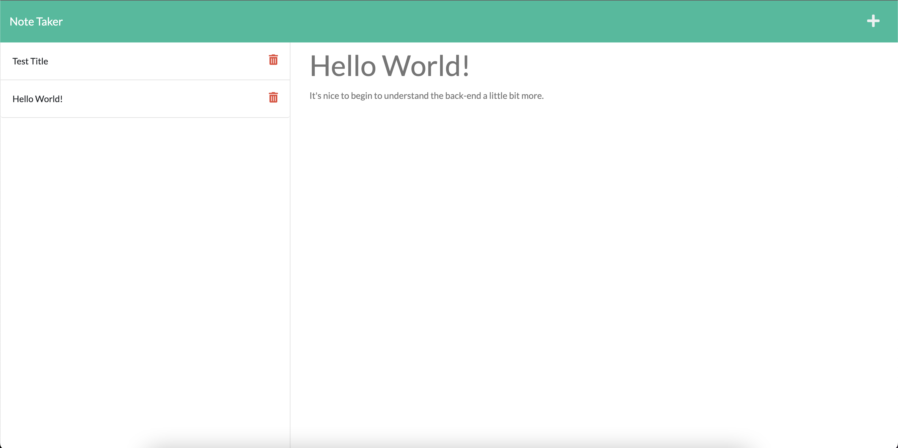

# Note Taker

## Description
Note Take is a web application that uses Express.js to host the notes app over a server. Each note taken is stored as an object in an API, which is used to display the stored information on the screen, using GET and POST requests.

## Table of Contents
* [Installation](#Installation)
* [Usage](#Usage)
* [License](#License)
* [Contributing](#Contributing)
* [Tests](#Tests)
* [Questions](#Questions)

## Installation
To install the necessary dependencies please run the following command:

`git pull` followed by `npm i` to install the required dependencies.

## Usage
This project can be used at one's own leisure.

## License
        
This project is licensed under the MIT license

## Contributing
To contribute to this project, please fork and push to a new branch and contact me for review for a potential merge.

## Tests
To run tests, run the following command:

`npm test`

## Questions
If there are any questions concerning this project, please open an issue or contact me directly at just.julio95@gmail.com.

If you would like to see more of my work, please visit my [Github](https://github.com/justjulio95).

## Deployed Site
[Note Taker](https://lit-tundra-28386.herokuapp.com/notes)

## Screen Shot
